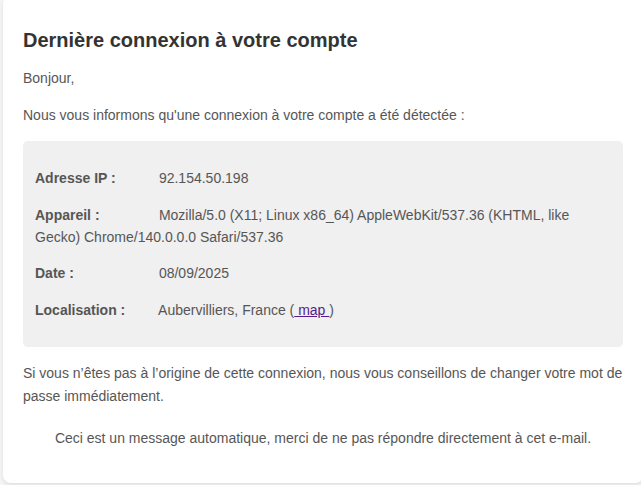

# SpiriitLabs Auth Log Bundle

With this Symfony bundle you can send an email alert when a user logs in from a new context — for example:

* a different IP address
* a different location (geolocation)
* a different User Agent (device/browser)

This helps detect unusual login activity early and increases visibility into authentication events.

[](LICENSE)
[](https://php.net)
[](https://symfony.com)
[](https://packagist.org/packages/spiriitlabs/auth-log-bundle)
[](https://github.com/SpiriitLabs/auth-log-bundle/actions/workflows/ci.yml)

> **Upgrading from v1?** See the [UPGRADE.md](UPGRADE.md) guide for a step-by-step migration.

## OWASP Authentication Best Practices

To ensure strong authentication security, this bundle aligns with guidance from the OWASP Authentication Cheat Sheet by:

* Treating authentication failures or unusual logins as events worthy of detection and alerting
* Ensuring all login events are logged, especially when the context changes (IP, location, device)
* Using secure channels (TLS) for all authentication-related operations
* Validating and normalizing incoming data (e.g. user agent strings, IP addresses) to avoid ambiguity or spoofing

## Features

- **Authentication Event Logging**: Track successful logins with IP, user agent, timestamp and location
- **Geolocation Support**: Enrich logs with location data using GeoIP2 or IP API
- **Email Notifications**: Automatically alert users when a login from an unknown context is detected
- **Messenger Integration**: Optional async processing with Symfony Messenger
- **Repository-Based Persistence**: No factory or listener boilerplate — implement two interfaces in your repository and you're done
- **Extensible**: Replace the default email notification with any custom transport via `NotificationInterface`

## Getting Started

### 1. Install

```bash
composer require spiriitlabs/auth-log-bundle
```

### 2. Configure

```yaml
# config/packages/spiriit_auth_log.yaml
spiriit_auth_log:
    transports:
        sender_email: 'no-reply@yourdomain.com'
        sender_name: 'Security'
```

### 3. Implement `AuthLogUserInterface` on your User entity

`AuthLogUserInterface` extends `UserInterface`, so you no longer need to declare it explicitly.

```php
use Spiriit\Bundle\AuthLogBundle\Entity\AuthLogUserInterface;

class User implements AuthLogUserInterface
{
    // ... your existing User fields

    public function getAuthLogEmail(): string
    {
        return $this->email;
    }

    public function getAuthLogDisplayName(): string
    {
        return $this->name;
    }
}
```

### 4. Create your log entity

Extend `AbstractAuthenticationLog` and add a relation to your User entity:

```php
use Doctrine\ORM\Mapping as ORM;
use Spiriit\Bundle\AuthLogBundle\Entity\AbstractAuthenticationLog;
use Spiriit\Bundle\AuthLogBundle\Entity\AuthLogUserInterface;
use Spiriit\Bundle\AuthLogBundle\FetchUserInformation\UserInformation;

#[ORM\Entity(repositoryClass: UserAuthLogRepository::class)]
class UserAuthLog extends AbstractAuthenticationLog
{
    #[ORM\Id, ORM\GeneratedValue, ORM\Column]
    private ?int $id = null;

    #[ORM\ManyToOne(targetEntity: User::class)]
    private User $user;

    public function __construct(User $user, UserInformation $userInformation)
    {
        $this->user = $user;
        parent::__construct($userInformation);
    }

    public function getUser(): AuthLogUserInterface
    {
        return $this->user;
    }
}
```

### 5. Create the repository

Your repository must implement two interfaces:

- `AuthenticationLogRepositoryInterface` — check if a log already exists and save new logs
- `AuthenticationLogCreatorInterface` — build the log entity from a user identifier and user information

```php
use Doctrine\ORM\EntityRepository;
use Spiriit\Bundle\AuthLogBundle\AuthenticationLog\AuthenticationLogCreatorInterface;
use Spiriit\Bundle\AuthLogBundle\Entity\AuthenticationLogInterface;
use Spiriit\Bundle\AuthLogBundle\FetchUserInformation\UserInformation;
use Spiriit\Bundle\AuthLogBundle\Repository\AuthenticationLogRepositoryInterface;

class UserAuthLogRepository extends EntityRepository implements
    AuthenticationLogRepositoryInterface,
    AuthenticationLogCreatorInterface
{
    public function save(AuthenticationLogInterface $log): void
    {
        $this->getEntityManager()->persist($log);
        $this->getEntityManager()->flush();
    }

    public function findExistingLog(string $userIdentifier, UserInformation $userInformation): bool
    {
        return null !== $this->findOneBy([
            'user' => $userIdentifier,
            'ipAddress' => $userInformation->ipAddress,
        ]);
    }

    public function createLog(string $userIdentifier, UserInformation $userInformation): AuthenticationLogInterface
    {
        $user = $this->getEntityManager()->getRepository(User::class)->findOneBy([
            'email' => $userIdentifier,
        ]);

        return new UserAuthLog($user, $userInformation);
    }
}
```

That's it! The bundle automatically listens to `LoginSuccessEvent`, checks if the login context is known, persists the log, and sends a notification email when a new context is detected.

## Options

### Geolocation

**GeoIP2** (local database):
```yaml
spiriit_auth_log:
    location:
        provider: 'geoip2'
        geoip2_database_path: '%kernel.project_dir%/var/GeoLite2-City.mmdb'
```

**IP API** (external API, 45 req/min free):
```yaml
spiriit_auth_log:
    location:
        provider: 'ipApi'
```

### Messenger (async processing)

```yaml
spiriit_auth_log:
    messenger: 'messenger.default_bus'
```

Optional routing:
```yaml
framework:
    messenger:
        routing:
            'Spiriit\Bundle\AuthLogBundle\Messenger\AuthLoginMessage\AuthLoginMessage': async
```

## Events

When a new device/context is detected, the bundle dispatches a `AuthenticationLogEvents::NEW_DEVICE` event. You can listen to it for custom processing (logging, analytics, etc.):

```php
use Spiriit\Bundle\AuthLogBundle\Listener\AuthenticationLogEvent;
use Spiriit\Bundle\AuthLogBundle\Listener\AuthenticationLogEvents;
use Symfony\Component\EventDispatcher\Attribute\AsEventListener;

#[AsEventListener(event: AuthenticationLogEvents::NEW_DEVICE)]
final class NewDeviceListener
{
    public function __invoke(AuthenticationLogEvent $event): void
    {
        $userIdentifier = $event->userIdentifier();
        $userInformation = $event->userInformation();

        // your custom logic here
    }
}
```

> **Note:** Persistence and notification are handled automatically by the bundle. You do **not** need to listen to this event for the bundle to work.

## Login Confirmation ("It was me / It wasn't me")

This optional feature adds two **signed links** to the notification email so the user can confirm the login was theirs — or report that it wasn't — from any device, without being logged in.

- The links are signed with your application secret and carry an expiration.
- Clicking a link opens an intermediate page with a confirmation button that **POSTs** the action. This prevents email link scanners (Outlook Safe Links, etc.) from triggering the action just by following the URL.
- A link is **single-use**: once the login is acknowledged or disavowed, replaying it shows an "already handled" page.

The bundle only records the outcome and **dispatches an event** — your application decides what to do next (e.g. force a password change or log out other sessions on a disavow).

### 1. Enable the feature

```yaml
spiriit_auth_log:
    confirmation:
        enabled: true
        token_ttl: '3 days'   # relative expression: "12 hours", "1 week"...
```

Generating absolute URLs from a Messenger worker (no request context) requires a default URI:

```yaml
# config/packages/routing.yaml
framework:
    router:
        default_uri: 'https://your-domain.com'
```

### 2. Make your log entity confirmable

Add the trait and interface to the entity that already extends `AbstractAuthenticationLog`, then generate a migration for the new columns (`confirmation_token`, `status`, `responded_at`):

```php
use Spiriit\Bundle\AuthLogBundle\Entity\AbstractAuthenticationLog;
use Spiriit\Bundle\AuthLogBundle\Entity\ConfirmableAuthenticationLogInterface;
use Spiriit\Bundle\AuthLogBundle\Entity\ConfirmableAuthenticationLogTrait;

#[ORM\Entity(repositoryClass: UserAuthLogRepository::class)]
class UserAuthLog extends AbstractAuthenticationLog implements ConfirmableAuthenticationLogInterface
{
    use ConfirmableAuthenticationLogTrait;

    // ... your existing fields
}
```

> If you don't enable the feature, nothing changes: the trait and columns are opt-in, so existing integrators don't need a migration.

### 3. Implement the confirmable repository

```php
use Spiriit\Bundle\AuthLogBundle\Entity\ConfirmableAuthenticationLogInterface;
use Spiriit\Bundle\AuthLogBundle\Repository\ConfirmableAuthenticationLogRepositoryInterface;

class UserAuthLogRepository extends EntityRepository implements
    AuthenticationLogRepositoryInterface,
    AuthenticationLogCreatorInterface,
    ConfirmableAuthenticationLogRepositoryInterface
{
    // ... existing methods

    public function findOneByConfirmationToken(string $confirmationToken): ?ConfirmableAuthenticationLogInterface
    {
        return $this->findOneBy(['confirmationToken' => $confirmationToken]);
    }
}
```

### 4. Expose the confirmation route

You keep full control over the route. Pick one of the two approaches.

**a. Import the default route** (simplest). You may add a `prefix`, `host` or `condition` — the generated links follow it automatically:

```yaml
# config/routes/spiriit_auth_log.yaml
spiriit_auth_log:
    resource: '@SpiriitAuthLogBundle/config/routes.php'
    prefix: /security   # optional
```

**b. Declare your own route** and point the bundle at it — use this when you want your own path or format:

```yaml
# config/routes.yaml
my_login_confirmation:
    path: /account/logins/{action}/{token}
    controller: spiriit_auth_log.confirmation_controller
    methods: [GET, POST]
    requirements: { action: 'acknowledge|disavow' }
```

```yaml
spiriit_auth_log:
    confirmation:
        enabled: true
        route_name: my_login_confirmation   # defaults to "spiriit_auth_log_confirm"
```

### 5. React to the user's response

The bundle dispatches `AuthenticationLogEvents::LOGIN_ACKNOWLEDGED` or `AuthenticationLogEvents::LOGIN_DISAVOWED`, carrying the confirmed log:

```php
use Spiriit\Bundle\AuthLogBundle\Listener\AuthenticationLogConfirmationEvent;
use Spiriit\Bundle\AuthLogBundle\Listener\AuthenticationLogEvents;
use Symfony\Component\EventDispatcher\Attribute\AsEventListener;

#[AsEventListener(event: AuthenticationLogEvents::LOGIN_DISAVOWED)]
final class LoginDisavowedListener
{
    public function __invoke(AuthenticationLogConfirmationEvent $event): void
    {
        $log = $event->authenticationLog();
        $user = $log->getUser();

        // e.g. force a password reset, invalidate sessions, notify security...
    }
}
```

You can override the confirmation pages the same way as the email template, under
`templates/bundles/SpiriitAuthLogBundle/confirmation/`.

## Custom Notification

By default, the bundle sends email alerts via Symfony Mailer. To use a different transport (Slack, SMS, etc.), implement `NotificationInterface` and register it as a service:

```php
use Spiriit\Bundle\AuthLogBundle\Confirmation\ConfirmationLinks;
use Spiriit\Bundle\AuthLogBundle\DTO\UserReference;
use Spiriit\Bundle\AuthLogBundle\FetchUserInformation\UserInformation;
use Spiriit\Bundle\AuthLogBundle\Notification\NotificationInterface;

final class SlackNotification implements NotificationInterface
{
    public function send(UserInformation $userInformation, UserReference $userReference, ?ConfirmationLinks $confirmationLinks = null): void
    {
        // send a Slack message, SMS, etc.
        // $confirmationLinks is null unless the confirmation feature is enabled
    }
}
```

Then point the `mailer` transport to your service ID:

```yaml
spiriit_auth_log:
    transports:
        mailer: 'App\Notification\SlackNotification'
        sender_email: 'no-reply@yourdomain.com'
        sender_name: 'Security'
```

## Custom Email Template

You can override the default email template:



Create the file:

```
templates/bundles/SpiriitAuthLogBundle/new_device.html.twig
```

Available variables in the template:

| Variable | Type | Description |
|---|---|---|
| `userInformation.ipAddress` | `?string` | Client IP address |
| `userInformation.userAgent` | `?string` | Browser / device user agent |
| `userInformation.loginAt` | `?DateTimeImmutable` | Login timestamp |
| `userInformation.location` | `?LocateValues` | Geolocation (city, country, latitude, longitude) |
| `authenticableLog.displayName` | `string` | User display name |
| `authenticableLog.email` | `string` | User email |
| `confirmationLinks` | `?ConfirmationLinks` | `acknowledgeUrl` / `disavowUrl` — only set when the confirmation feature is enabled |

## Architecture

Internal flow when a user logs in:

1. `LoginListener` catches Symfony's `LoginSuccessEvent`
2. Builds a `LoginParameterDto` from the request (IP, user agent, user identifier)
3. Dispatches to `LoginService` (sync) or `AuthLoginMessage` (async via Messenger)
4. `LoginService` fetches geolocation data via `FetchUserInformation`
5. `DoctrineAuthenticationLogHandler` checks if the context is known (`findExistingLog`), and if not, creates and saves the log (`createLog` + `save`)
6. Dispatches `AuthenticationLogEvents::NEW_DEVICE` event
7. Sends notification via `NotificationInterface`

## Testing

```bash
composer test              # Run the test suite
composer cs-check          # Check code style (dry-run)
composer cs-fix            # Fix code style
vendor/bin/phpstan analyse # Static analysis
```

## Contributing

Contributions are welcome! Please feel free to submit a Pull Request

## License

This bundle is released under the MIT License. See the [LICENSE](LICENSE) file for details.

## Support

For questions and support, please contact [dev@spiriit.com](mailto:dev@spiriit.com) or open an issue on GitHub.
